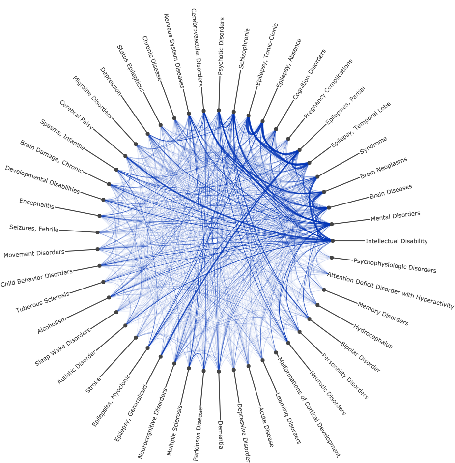

# PlotlyJSFactory

A package that extends the functionality of plotlyjs via [PlotlyJS.jl](https://github.com/sglyon/PlotlyJS.jl)

## Installation
```julia
Pkg.clone("https://github.com/mirestrepo/PlotlyJSFactory.jl.git")
```

## Additional functionality

| [Chord diagram from a network/graph](http://nbviewer.jupyter.org/github/mbphil/PlotlyJSFactory.jl/blob/master/examples/chord_plot_julia1.ipynb)|
|:-----------------:|
| [](http://nbviewer.jupyter.org/github/mbphil/PlotlyJSFactory.jl/blob/master/examples/chord_plot_julia1.ipynb)|
